# How-To Lists <!-- omit in toc -->

This How-To details some methods for working with `Lists` in Stadium. 

1. [Creating Lists](#creating-lists)
2. [Setting List Types](#setting-list-types)
3. [Adding Static Data](#adding-static-data)
4. [Adding Connector, JSON or Javascript Data](#adding-connector-json-or-javascript-data)
5. [Value Mapping](#value-mapping)
6. [Adding Items to Lists](#adding-items-to-lists)
7. [Removing Items from Lists](#removing-items-from-lists)
8. [Adding Properties to Lists](#adding-properties-to-lists)
9. [Removing Properties from Lists](#removing-properties-from-lists)
10. [Other List Repos](#other-list-repos)

## Creating Lists

Lists are always of a specific type. The type can be selected in the `Item Type` property of a `List`

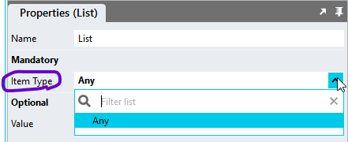

If the `ListItemType` property is set to `Any`, then the List will accept any JavaScript array. So, then you can assign an array of values or an array of objects of any complexity. 

However, as the type of each item is not known in this case, Stadium will treat each list item as a value. So, when assigning an array of objects, dropdowns in the rest of Stadium will not display the properties of the object. 

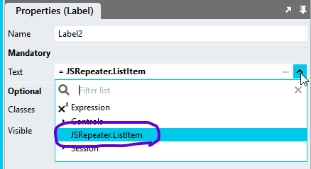

To access properties of a list of objects, the property can manually be appended to the list item

```javascript
~.AnyList.ListItem.id;
```

## Setting List Types

It is therefor advisable to set the `ListItemType` property to a known type when working with `Lists` of objects. It then becomes necessary to first create a type in the `Types` section in the `ApplicationExplorer` and subsequently select that type in the `ListItemType` property. 

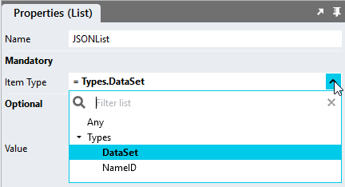

When a type is defined, various dropdowns in the Stadium Designer will provide an option to select specific properties os the `List`

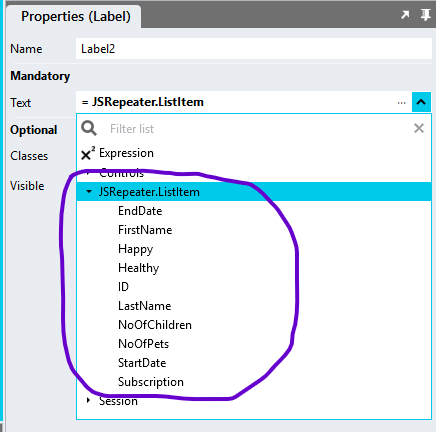

## Adding Static Data

Adding static data for Lists of type `Any` can be added opening the `List Editor` on the `List` `Value` property where values can then be added directly into the editor. 

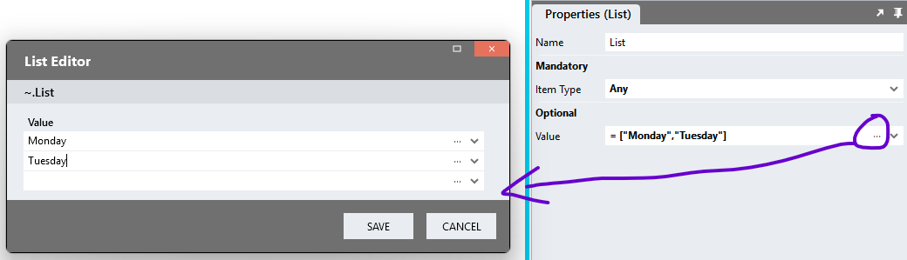

Object data for defined types can be added by further opening the `Object Properties Editor` next to items in the `List Editor`. 

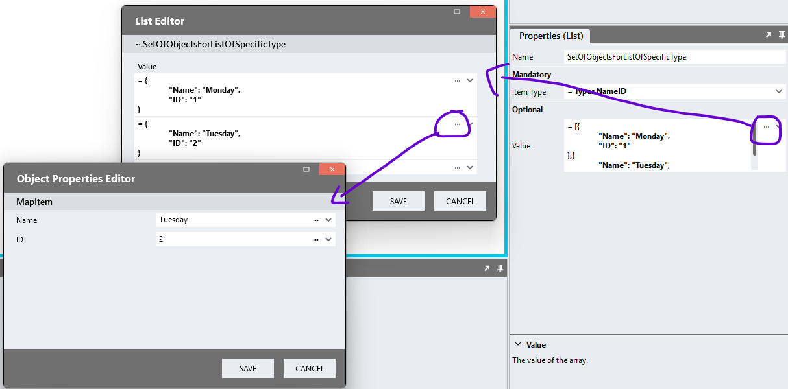

## Adding Connector, JSON or Javascript Data

Connector Data is commonly provided as a List JSON ist of objects. The `Result` of a query or any other JSON or Javascript array can hence be directly assigned to a `List` when the `List Item Type` contains all or a subset of the properties of the incoming data. For this purpose

1. Create a type with properties that match those of the incoming dataset
2. Assign the type to the `Item Type` property of the `List`
3. Assign the data to the `List` `Value` property. Fields will be auto-matched where property names are the same. 

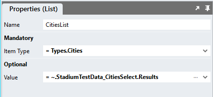

## Value Mapping

Incoming properties can be mapped to `List` properties when names of the properties of the assigned data differ from the `List` `Item Type` properties. For this purpose, selet the `Field Mapping` option in the `List` `Value` property dropdown. 

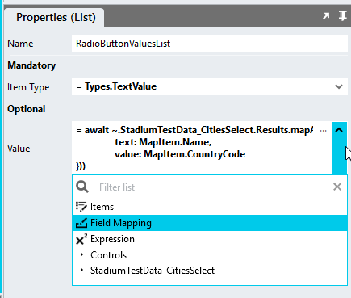

The `Mapping Editor` displays information in two columns, the target information on the left and the source on the right. 

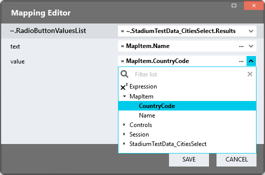

The target information column (left) provides the 
1. Target List 
2. All mappable properties of the Target

The source column (right) provides 
1. A dropdown to select the source data `List`
2. Input fields to define the mapping for source List properties. The `MapItem` option in the dropdown represents a `List Item`. Where suh an item consists of a known type, the type properties are provided for selection. 

## Adding Items to Lists

Adding items into a `List` can be accomplished by using a `Javascript` action. 

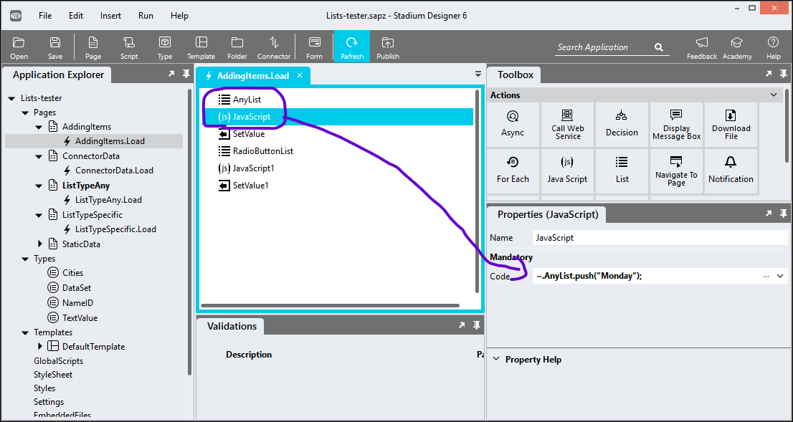

The Javascript push function also accepts objects for defined `List` types

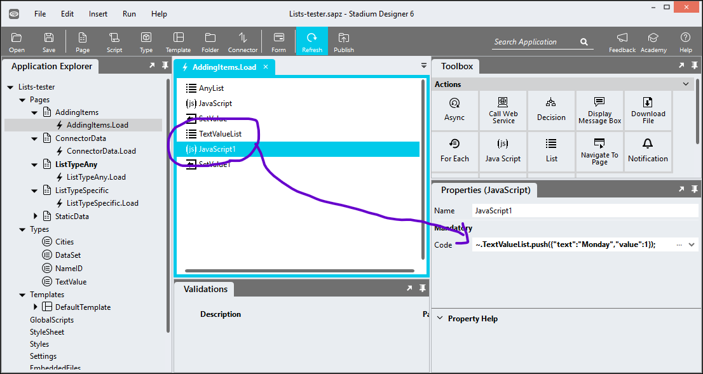

```javascript
~.TextValueList.push({"text":"Monday","value":1});
```

Using this method, one `List` can be populated with values from another one in a `ForEach` loop. 

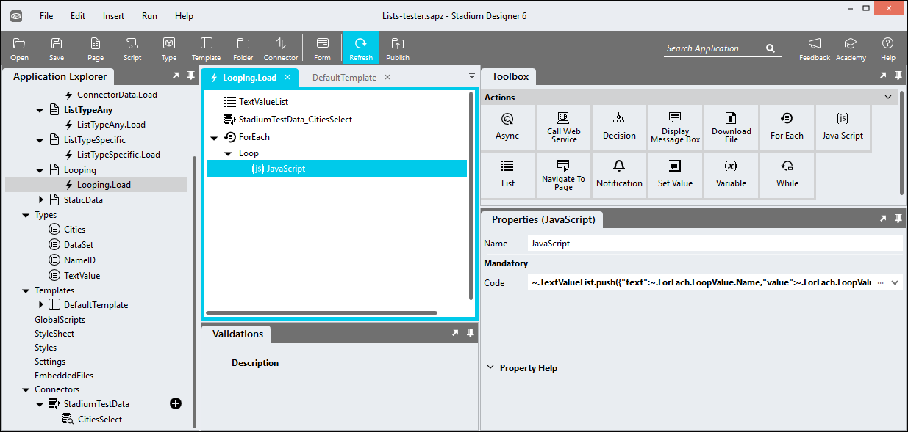

```javascript
~.TextValueList.push({"text":~.ForEach.LoopValue.Name,"value":~.ForEach.LoopValue.CountryCode});
```

## Removing Items from Lists

Individual items from be removed from `Lists` using a variety of different Javascript functions.

**Splice**
Splice modifies the original `List`

```javascript
~.AnyList.splice(1, 0); // Removes 1 element starting from index 0 (the first list item)
```

**Pop**
Removes and returns the last element of a `List`

```javascript
let lastElement = ~.AnyList.pop();
```

**Shift**
Removes and returns the first element of a `List`

```javascript
let firstElement = ~.AnyList.shift();
```

**Delete**
Removes an element at a specific index, but leaves an "empty slot" (the `List` length remains the same, and the value at that index becomes undefined)

This example works for a `List` of values
```javascript
delete ~.AnyList[~.AnyList.indexOf("Bob")];
```

This example works for a `List` of objects where the object has a property called 'id' with a unique value
```javascript
delete ~.UsersList[~.UsersList.findIndex(user => user.id === 1)];
```

**Filter**
Creates a new `List` containing only the elements that pass a provided test function. In this case it returns all values that are larger than 3

```javascript
let newList = ~.AnyList.filter(num => num > 3);
```

## Adding Properties to Lists
Adding a property with a distinct value to a `List` of a specific type (a List of objects) can be achieved by looping through the `List`

```javascript
~.UsersList.forEach(obj => {
    obj.age = 26;
});
```

Adding a property with the same value can also be achieved without an explicit loop. This function returns a new `List`
```javascript
const newList = ~.UsersList.map(obj => {
    return { ...obj, isActive: true }; // Creates a new object with existing properties and the new 'isActive' property
});
```

## Removing Properties from Lists 
Removing a property from a `List` of a specific type (a List of objects) can be achieved by looping through the `List`

```javascript
~.UsersList.forEach(obj => {
    delete obj.age; 
});
```

## Other List Repos 
A number of other repos exist to assist with the manipulation of `List` data

1. [Deduplicate List](https://github.com/stadium-software/utils-deduplicate-array)
2. [Filter List of Objects](https://github.com/stadium-software/utils-filter-objects-list)
3. [Insert Into List At](https://github.com/stadium-software/utils-insert-into-array-at)
4. [Sort List By](https://github.com/stadium-software/utils-sort-array-by)
